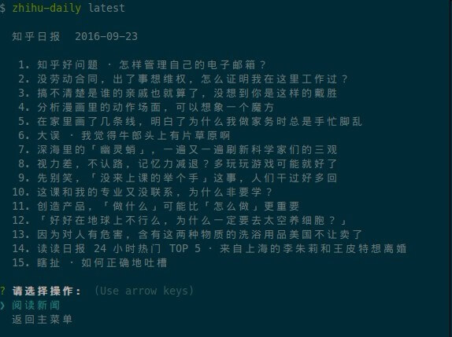

# node-zhihu-daily

[](https://www.npmjs.com/package/node-zhihu-daily)
[](https://www.npmjs.com/package/node-zhihu-daily)
[](https://opensource.org/licenses/MIT)

## Installation

Prerequisity: [Node.js](https://nodejs.org/en/) (>=6.x)

``` bash
$ npm install -g node-zhihu-daily
```

## Usage

``` bash
Usage: zhihu-daily <command> [option]

Commands:

  run|r       run zhihu daily
  latest|l    fetch latest news
  news|n      fetch previous news via date
  theme|t     fetch theme newspapers
  section|s   fetch zhihu sections
  clear|c     clear cache files
  help [cmd]  display help for [cmd]

Options:

  -h, --help     output usage information
  -V, --version  output the version number
```

## Example

### Fetch latest newspaper



### Read news


### Fetch theme newspapers


### Fetch zhihu sections


## Credits

* [Zhihu Daily API](https://github.com/izzyleung/ZhihuDailyPurify/wiki/%E7%9F%A5%E4%B9%8E%E6%97%A5%E6%8A%A5-API-%E5%88%86%E6%9E%90) by [izzyleung](https://github.com/izzyleung)
* [commander.js](https://github.com/tj/commander.js) by [tj](https://github.com/tj)
* [superagent](https://github.com/visionmedia/superagent) by [visionmedia](https://github.com/visionmedia)
* [inquirer](https://github.com/SBoudrias/Inquirer.js/) by [SBoudrias](https://github.com/SBoudrias)
* [cheerio](https://github.com/cheeriojs/cheerio/) by [cheeriojs](https://github.com/cheeriojs)
* [chalk](https://github.com/chalk/chalk) by [chalk](https://github.com/chalk)

## License

[MIT](https://opensource.org/licenses/MIT)
